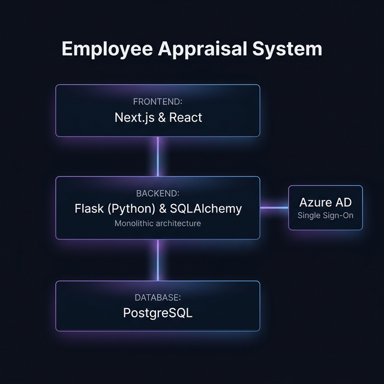

# Employee Appraisal System (EAS)

A comprehensive, full-stack Employee Appraisal System built with a microservices architecture. Features include role-based access control (RBAC), SSO authentication, appraisal workflows, goal management (OKRs), and reporting.



## 🏗 Architecture

The system is composed of the following services:

| Service | Technology | Description |
| :--- | :--- | :--- |
| **Frontend** | Next.js 16 (App Router), React, TailwindCSS, shadcn/ui | The user interface for employees, managers, and admins. |
| **Backend** | Flask, SQLAlchemy, PostgreSQL | Consolidated monolithic backend handling Auth, Users, Appraisals, and Goals. |

## 🚀 Prerequisites

- **Docker & Docker Compose**: For running the containerized services.
- **Node.js 18+**: For local frontend development (optional if using Docker).
- **Python 3.9+**: For local backend development (optional if using Docker).
- **Azure AD Tenant**: For SSO integration (optional, local login fallback available).

## 🛠 Quick Start

1.  **Clone the repository:**
    ```bash
    git clone <repository-url>
    cd employee-appraisal-system
    ```

2.  **Configure Environment Variables:**
    Copy the example environment file and update it with your credentials.
    ```bash
    cp .env.example .env
    ```
    *See [AZURE_AD_SETUP.md](./AZURE_AD_SETUP.md) for SSO configuration details.*

3.  **Run with Docker Compose:**
    ```bash
    docker-compose up --build
    ```
    *The first run may take a few minutes to build images and initialize databases.*

4.  **Access the Application:**
    - **Frontend:** [http://localhost:3000](http://localhost:3000)
    - **API Gateway:** [http://localhost:5000](http://localhost:5000)

## 🔑 Default Credentials (Seeded)

The system is seeded with a demo organization.

> [!WARNING]
> **Security Notice**: These credentials and the `seed_demo.py` script are for local development and demonstration purposes ONLY. They must be removed or disabled before deploying to any production or publicly accessible environment.

| Role | Email | Password |
| :--- | :--- | :--- |
| **CEO** | `alice.smith@example.com` | `password` |
| **Director (HR)** | `bob.jones@example.com` | `password` |
| **Manager** | `charlie.brown@example.com` | `password` |
| **Employee** | `david.wilson@example.com` | `password` |

---

### 🧼 Database Reset & Seeding

If you need to wipe the database and start fresh with the demo personas, run:

```bash
.\scripts\reset-db.bat
```

This will automatically:
1. Recreate all database tables.
2. Seed Alice, Bob, Charlie, and David.
3. Set David Wilson's start date to **Feb 15, 2026** (to test new joiner logic).

---

### ⏳ Time Travel Simulation

If you want to quickly see the results of a **completed** appraisal flow without waiting for months:

1. Run the simulation script:
   ```bash
   .\scripts\simulate-progression.bat
   ```
2. This script will:
   - **Backdate David Wilson**: Sets his start date to 6 months ago (making him eligible for Annual cycle).
   - **Complete Appraisal**: Instantly populates and completes David's 2026 appraisal with demo ratings and comments.

This allows you to demonstrate the "Final Results" and "Meeting Notes" screens immediately.

---

## 📂 Folder Structure

├── docker-compose.yml      # Orchestration
├── frontend/               # Next.js Application
├── backend/                # Consolidated Monolith Backend
│   ├── app.py              # Application Entrypoint
│   ├── models/             # Database Models
│   └── routes/             # API Routes
├── scripts/                # Database Operations & Maintenance Scripts
└── AZURE_AD_SETUP.md       # SSO Configuration Guide

## ⚠️ Environment Variables

Refer to `.env.example` for the complete list. Key variables include:

- `NEXTAUTH_SECRET`: Secret for NextAuth session encryption.
- `JWT_SECRET_KEY`: Shared secret for verifying backend tokens.
- `AZURE_CLIENT_ID` / `AZURE_CLIENT_SECRET`: For Microsoft Entra ID integration.
- `POSTGRES_USER` / `POSTGRES_PASSWORD`: Database credentials.

